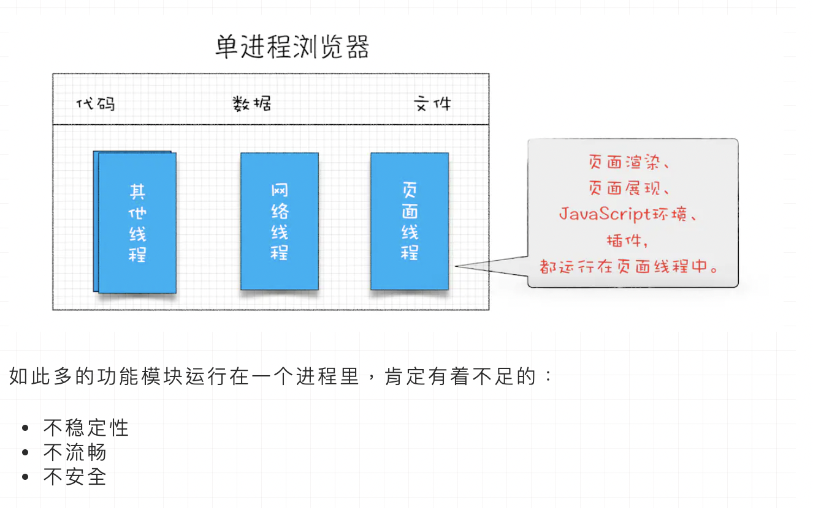
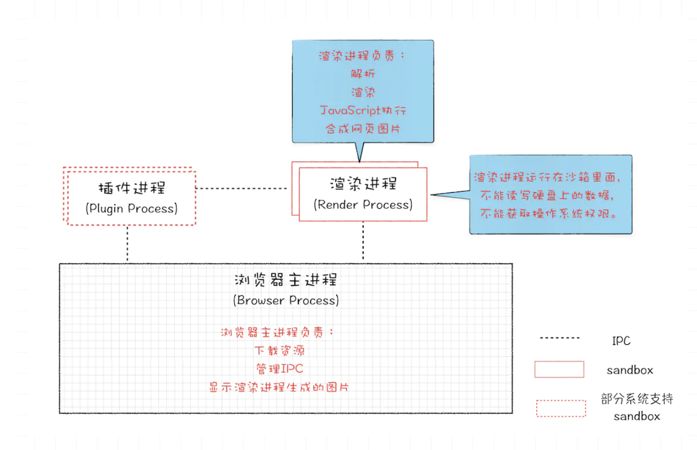
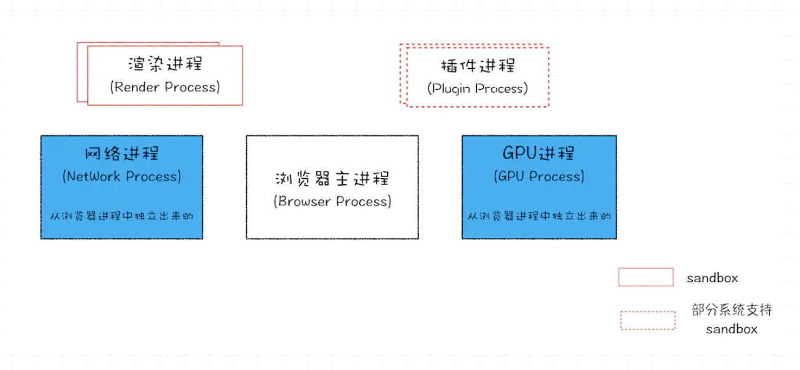
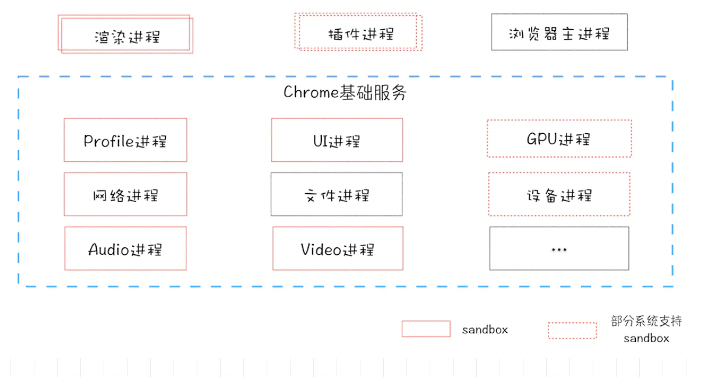
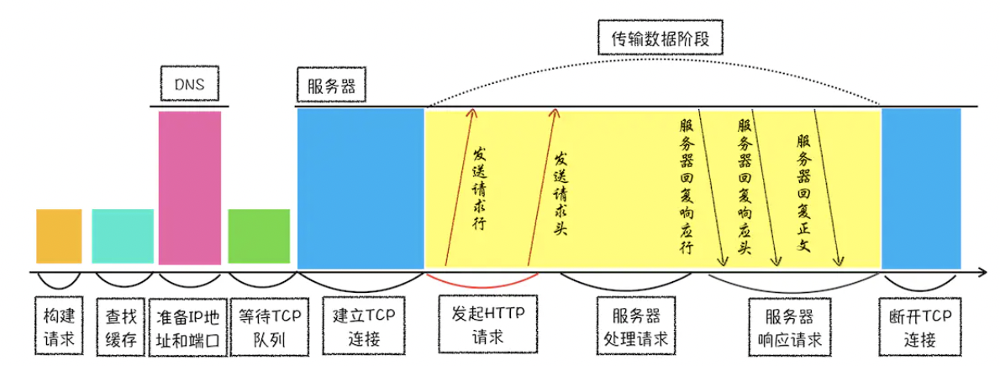
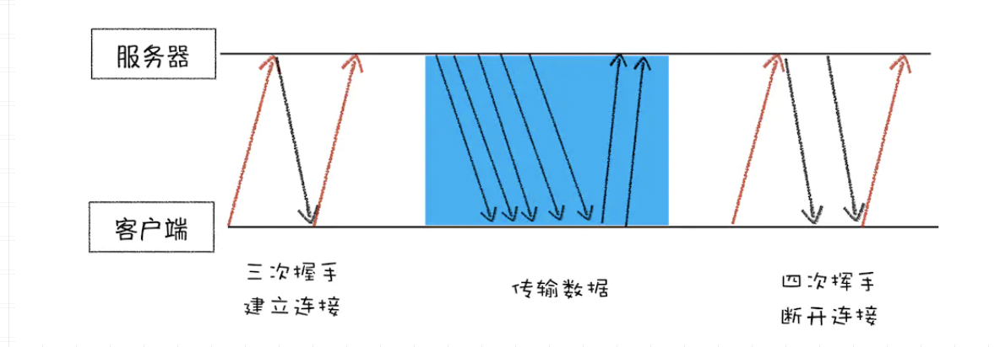
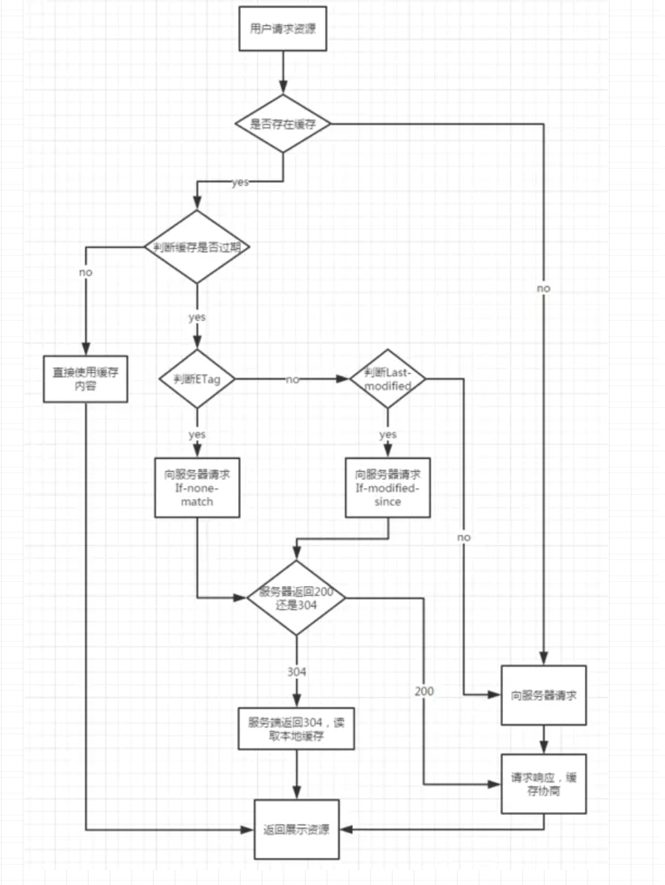
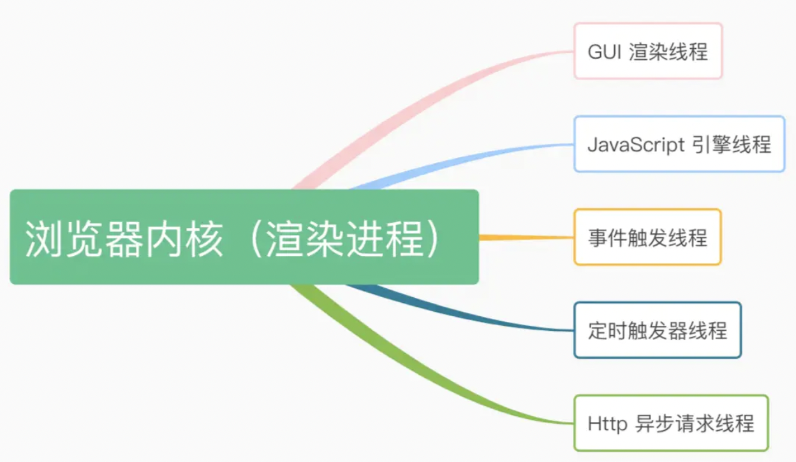

### 进程和线程
ps: @see [掘金原文搬运](https://juejin.im/post/5f007d32f265da22b64936bf#heading-8s)
#### 进程 

开启一个程序的时候，就是开启了一个进程，操作系统会为这个程序分配一个内存空间，
用来`存放代码`，`运行时数据`，和一个`执行任务的主线程`。这样的运行环境叫进程

#### 线程

线程是进程中的一部分，是依附于进程的。

#### 线程和进程关系
1。线程之间共享进程的数据
2。一个线程崩溃，整个进程就奔溃了
3。一个进程关闭之后，操作系统会回收进程所占用的内存
4。进程之间的内容相互隔离

### 浏览器架构
1。单进程浏览器时代

2。早期多进程架构

1）页面是运行在一个渲染进程中（包括css渲染和js运行），而页面中用到的一些插件，一些浏览器提供的api，是运行在一个插件进程中的。

2）不同的页面在不同的渲染进程中

3）进程之间是通过 IPC 机制进行通信

4）不同的进程被所在各自的安全沙箱中，恶意程序等不能突破这个安全沙箱，去获取操作系统权限，或者攻击另外一个进程中的程序

3。目前多进程架构

**运行的进程在Chrome中可以通过任务管理器进程查看！**

浏览器进程。
    
    主要负责界面显示、用户交互、子进程管理，同时提供存储等功能。
渲染进程。
    
    核心任务是将 HTML、CSS 和 JavaScript 转换为用户可以与之交互的网页，排版引擎 Blink 和 JavaScript 引擎 V8 都是运行在该进程中，默认情况下，Chrome 会为每个 Tab 标签创建一个渲染进程。出于安全考虑，渲染进程都是运行在沙箱模式下。
GPU 进程。
    
    其实，Chrome 刚开始发布的时候是没有 GPU 进程的。而 GPU 的使用初衷是为了实现 3D CSS 的效果，只是随后网页、Chrome 的 UI 界面都选择采用 GPU 来绘制，这使得 GPU 成为浏览器普遍的需求。最后，Chrome 在其多进程架构上也引入了 GPU 进程。
网络进程。
    
    主要负责页面的网络资源加载，之前是作为一个模块运行在浏览器进程里面的，直至最近才独立出来，成为一个单独的进程。
插件进程。
    
    主要是负责插件的运行，因插件易崩溃，所以需要通过插件进程来隔离，以保证插件进程崩溃不会对浏览器和页面造成影响。

虽然多进程模型提升了浏览器的稳定性、流畅性和安全性，但同样不可避免地带来了一些问题：

    更高的资源占用。
    因为每个进程都会包含公共基础结构的副本（如 JavaScript 运行环境），这就意味着浏览器会消耗更多的内存资源。
    
    更复杂的体系架构浏览器各模块之间耦合性高、扩展性差等问题，会导致现在的架构已经很难适应新的需求了

4。 未来面向服务的架构 —— SOA

Chrome 最终要把 UI、数据库、文件、设备、网络等模块重构为基础服务，类似操作系统底层服务

5。 q

1）为什么单进程浏览器当时不可以采用安全沙箱？

    只有一个进程，所有浏览器中程序都在这个进程中跑着，如果使用了安全沙箱，那么相当于整个浏览器都被沙箱隔离起来了，不能跟系统有任何交互了，比如要保存图片，上传图片这些操作就都无法完成了
    
2）打开Chrome浏览器一个Tab页面，至少会出现几个进程？

    渲染进程，浏览器主进程，插件进程 三个？❌ 
A: 包括至少四个:
    1 个浏览器（Browser）主进程、
    1 个 GPU 进程、
    1 个网络（NetWork）进程、
    多个渲染进程和多个插件进程
    
    当然还有复杂的情况:
        1. 页面中有iframe的话,iframe会单独在进程中
        2. 有插件的话，插件也会开启进程
        3. 多个页面属于同一站点，并且从a打开b页面，会共用一个渲染进程
        4. 装了扩展的话，扩展也会占用进程
    
3）即使如今多进程架构，还是会碰到单页面卡死的最终崩溃导致所有页面崩溃的情况，讲一讲你的理解？

    1）如果浏览器中打开的页面a,b，c...页面属于同一个站点，且是连带打开的关系（a->b,b->c..）,那么他们会使用同一个渲染进程，如果其中又一个页面卡死了，别的页面也会崩溃
    
官方A： 
Chrome的默认策略是，每个标签对应一个渲染进程。但是如果从一个页面打开了新页面，而新页面和当前页面属于同一站点时，那么新页面会复用父页面的渲染进程。
官方把这个默认策略叫process-per-site-instance。

**延伸：**
在一个渲染进程中的话，就会共享JS执行环境。
也就是A页面可以直接在B页面中执行脚本了,有些时候就是有这样子的需求嘛～

#### 总结
早期浏览器：不稳定（单独进程） 不流畅（单独进程） 不安全（沙箱）

早期多进程浏览器： 主进程 渲染进程 插件进程

现代多进程架构： 主进程 渲染进程 插件进程 GPU进程 网络进程

未来面向服务架构

### http请求

一个http请求的流程图

1. 构建请求
    
浏览器构建请求行信息（如下所示），构建好后，浏览器准备发起网络请求。
    
    GET /index.html HTTP1.1

2. 查找缓存

浏览器会先在浏览器缓存中查询是否有要请求的文件。
其中，浏览器缓存是一种在本地保存资源副本，以供下次请求时直接使用的技术

3. 准备ip地址和端口号

http通信的第一步是建立tcp链接，tcp链接的第一步是准备ip地址和端口号

**dns**系统完成来 **url -> ip+端口**，实现了域名和ip地址的映射关系

通常情况下，如果 URL 没有特别指明端口号，那么 HTTP 协议默认是 80 端口

浏览器会先在本地查找关于域名的缓存，如果没有，才去请求dns服务器

4.  等待tcp（同域名tcp链接 < 6 时，没有这一步）
        
        Chrome 有个机制，同一个域名同时最多只能建立 6 个 TCP 连接，如果在同一个域名下同时有 10 个请求发生，那么其中 4 个请求会进入排队等待状态，直至进行中的请求完成。

5. 建立 TCP 连接

TCP三次握手建立连接，http请求加上TCP头部——包括源端口号、目的程序端口号和用于校验数据完整性的序号，向下传输

   
6. http通信
请求行：【请求方法】+【url】+【协议版本】

        方法： get、post、delete。。。
        （如果是POST方法，浏览器还需要准备好数据，通过请求体发送给服务器）
请求头：把浏览器的基础信息告诉服务器

        host、connection、cache-control、user-agent、referer、cookie、accept-encoding、...
请求体

7. 服务器处理http请求
响应行：【HTTP协议版本】+【状态码】
    
响应头：包含服务器自身的一些信息
        
        last-modified、set-cookie、...
        
响应体： 具体的内容，比如一个页面的html资源，一个具体的数据。。。

8. 断开连接

一般情况下，服务器发送完数据后，就要关闭TCP连接。除非：【Connection:Keep-Alive】

**9. 重定向**

响应行的状态码是【301】，响应头中【Location】字段的值，代表重定向的网址

浏览器会获取Location字段中的地址，重新导航

10. 相关涉及

1）浏览器缓存流程

header中字段

    Cache-Control（重要策略）
    Expires
    Last-modified
    ETag

2) 浏览器输入一个url后的整体流程
（1）用户输入URL：
 
      浏览器会根据用户输入的信息判断是搜索还是网址，
      如果是搜索内容，就将搜索内容+默认搜索引擎合成新的URL；
      如果用户输入的内容符合URL规则，浏览器就会根据URL协议，在这段内容上加上协议合成合法的URL

### 渲染进程
@see [掘金原文](https://juejin.im/post/5f05d12a5188252e8406e37b)

渲染进程接受到CommitNavigation消息之后，
便开始与网络进程建立数据管道说起，此时渲染进程开始干活

